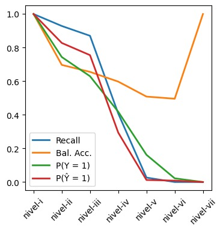
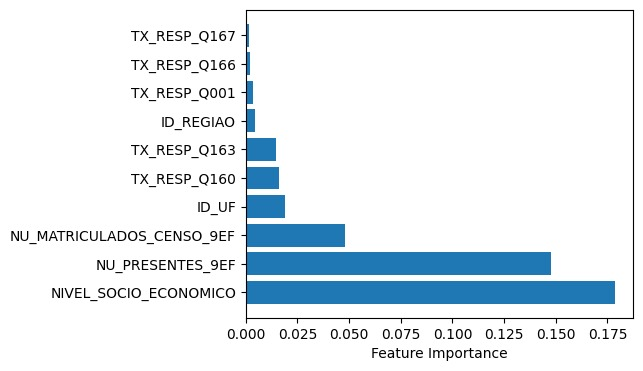

# Model Card for School Classification Logistic model

<!-- Provide a quick summary of what the model is/does. -->

Classifier of schools in need of special support (schools that present low results in SAEB) based
on feature values such as locality, administration type, etc.

## Model Details

### Model Description

<!-- Provide a longer summary of what this model is. -->

Ensemble Classifier of schools in need of special support, i.e., schools that presented results lower than 250 on SAEB. The model used is Logistic Regression and uses a subset of features obtained from the day of application of the test, the school's characteristics, and answers from the school director.

- **Developed by:** Juan David Nieto and Giovani Valdrighi
- **Model type:** Logistic Classifier

### Model Sources

<!-- Provide the basic links for the model. -->

- **Repository:** https://github.com/giovaniValdrighi/school_eval_ethical
- **Model files:** https://drive.google.com/drive/folders/1-8MBKLY2732kdCHe1S0H_xZHLao0VlaZ?usp=sharing

## Uses

<!-- Address questions around how the model is intended to be used, including the foreseeable users of the model and those affected by the model. -->

### Direct Use

<!-- This section is for the model use without fine-tuning or plugging into a larger ecosystem/app. -->

Identify schools that are underperforming in lessons of math and Portuguese and need support and special projections to surpass this condition.

### Out-of-Scope Use

<!-- This section addresses misuse, malicious use, and uses that the model will not work well for. -->

This model is not suited to identify schools that should be punished due to underperforming.
Some of the features are related to the socioeconomic characteristics of the school, and the label obtained from SAEB scores is also related to the socioeconomic characteristics of students and teachers. 
The classification is not able to reflect the effectiveness of the school in teaching.

## Bias, Risks, and Limitations

<!-- This section is meant to convey both technical and sociotechnical limitations. -->

The model presented good performance, however, the data is based on the answers of school directors in a particular year. It can have learned some spurious correlations. The target variable is also a proxy of the intended label. The system could be gamed by changing features and values that are easily changed and do not provide a change in school performance.

## Evaluation

### Metrics

<!-- These are the evaluation metrics being used, ideally with a description of why. -->

| Metric | Train | Test |
| ---- | ---- | ---- |
| ROC | 0.85 | 0.82 |
| Balanced accuracy | 0.76 | 0.74 |
| Recall score | 0.66 | 0.63 |
| Precision score | 0.76 | 0.73 |

    
### Model Examination

<!-- Relevant interpretability work for the model goes here -->

#### Feature selection

Features were selected using causality formulation, i.e., using the Markov Blanket independence test. Yet, a total of 50 features need to be validated with experts, as it was obtained from observational data, which can be not representative of the real causal system. 

#### Feature importance

We note a high correlation of prediction associated with the socioeconomic level of schools, substantiated by the significant importance of the socioeconomic dimension in modeling. This underscores the need to carefully consider this aspect in future iterations of the model.

